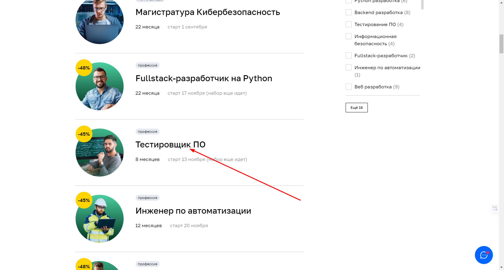

# План внедрения автоматизации
## **1 Автоматизация переходов с главной страницы до анкеты записи на странице**
*Предусловия:*  Открыта главная страница сайта Нетология [www.netology.ru](https://netology.ru).

*Ожидаемый результат:* Переход на страницу профессии “Тестировщик ПО”.

### **Переход через Каталог курсов, Программирование, Раздел профессии**
#### Шаги
1. Нажать на кнопку “Каталог курсов” на главной странице сайта [www.netology.ru](https://netology.ru).

2. Нажать на кнопку “Программирование” из выпавшего списка.

3. Проскроллить/пролистать до раздела “Тестировщик ПО” .

4. Нажать на раздел с профессией.

### **Переход через Каталог курсов, поисковую строку**
#### Шаги
1. Нажать на кнопку “Каталог курсов” на главной странице сайта [www.netology.ru](https://netology.ru).

2. Нажать на поле ввода для поиска.
3. Набрать первые несколько букв профессии ("Тест").

4. Нажать на иконку профессии из предлагаемого списка.

### **Переход через Каталог курсов, все курсы, раздел профессии**
#### Шаги
1. Нажать на кнопку “Каталог курсов” на главной странице, сайта [www.netology.ru](https://netology.ru).

2. Нажать кнопку “Все курсы” из выпадающего списка.

3. Проскроллить/пролистать до раздела “Тестировщик ПО”. 

4. Нажать на раздел с профессией.
   

### **Переход через каталог курсов, все курсы, поисковую строку**
#### Шаги
1. Нажать на кнопку “Каталог курсов” на главной странице сайта [www.netology.ru](https://netology.ru).

2. Нажать кнопку “Все курсы” из выпадающего списка.

3. Нажать на поле ввода для поиска.
4. Набрать первые несколько букв профессии ("Тест").

5. Нажать на иконку профессии из предлагаемого списка.

### **Переход через раздел Направления обучения, программирование, раздел профессии**
#### Шаги
1. На странице [www.netology.ru](https://netology.ru) найти раздел, "Направления обучения".
2. Нажать на раздел программирование.

3. Проскроллить/пролистать до раздела “Тестировщик ПО”.

4. Нажать на раздел с профессией.
   

### **Переход через раздел Направления обучения, программирование, поисковую строку**
#### Шаги
1. На странице [www.netology.ru](https://netology.ru) найти раздел, "Направления обучения".
2. Нажать на раздел программирование.

3. Нажать на поле ввода для поиска.
4. Набрать первые несколько букв профессии ("Тест").

5. Нажать на иконку профессии из предлагаемого списка.

### **Переход  через раздел Направления обучения, полный каталог, раздел професси**
#### Шаги
1. На странице [www.netology.ru](https://netology.ru) найти раздел, "Направления обучения".
2. Нажать на кнопку “Полный каталог”.

3. Проскроллить/пролистать до раздела “Тестировщик ПО”.

4. Нажать на раздел с профессией.

### **Переход  через раздел Направления обучения, полный каталог, поисковую строку**
#### Шаги
1. На странице [www.netology.ru](https://netology.ru) найти раздел, "Направления обучения".
2. Нажать на кнопку “Полный каталог”

3. Нажать на поле ввода для поиска.
4. Набрать первые несколько букв профессии ("Тест").

5. Нажать на иконку профессии из предлагаемого списка.

### **Переход  через раздел Направления обучения, полный каталог, программирование, раздел профессии**
#### Шаги
1. На странице [www.netology.ru](https://netology.ru) найти раздел, "Направления обучения".
2. Нажать на кнопку “Полный каталог”.

3. Нажать на кнопку “Программирование” из выпадающего списка.

4. Проскроллить/пролистать до раздела “Тестировщик ПО”. 

5. Нажать на раздел с профессией.
   

### **Переход  через раздел Направления обучения, полный каталог, программирование, поисковую строку**
#### Шаги
1. На странице [www.netology.ru](https://netology.ru) найти раздел, "Направления обучения".
2. Нажать на кнопку “Полный каталог”.

3. Нажать на кнопку “Программирование” из выпадающего списка.

4. Нажать на поле ввода для поиска.
5. Набрать первые несколько букв профессии ("Тест").

6. Нажать на иконку профессии из предлагаемого списка
   

## **1.2 Автоматизация заполнения анкеты, для записи на курс, со страницы профессии**

*Предусловия:* Открыта страница профессии “Тестировщик ПО” на сайте Нетологии https://netology.ru/programs/qa

*Ожидаемый результат:* Переход на анкету записи для обучения.

### **Переход через кнопку “Записаться” под кратким описанием курса**
Пролистать страницу по кнопки “Записаться”.

### **Переход через кнопку “Записаться” на верху страницы**
На странице https://netology.ru/programs/qa в правом верхнем углу нажать на кнопку "Записаться".

### **Пролистав страницу до конца, дойти до анкеты**
Пролистать страницу вниз, найти поле с ценами и анкетой.

## **1.3 Автоматизация тестирования отправки формы для записи на обучения**
*Предусловие:* Открыта форма для записи на курс “Тестировщик ПО” на сайте https://netology.ru/programs/qa#/order

**Заполнение анкеты валидными данными (happy path)**
* Поле "Имя".
Валидные данные: кириллица, латиница, пробел, дефис (пример: Иван, Roman, Ивано-Франциск, Али Абдула).
* Поле "Номер телефона".
Валидные данные: символ + в начале, 11 арабских цифр, пробел, тире(пример:+7(911) 1111111).

## **Отправка формы заполненной валидными данными**
1. Заполнить все поля валидными данными.
2. Нажать кнопку “Записаться”.

*Ожидаемый результат:* Отправка формы с надписью “Ваша заявка принята”.

## **Отправка формы с невалидными данными**

**Отправка формы с пустыми полями**
1. Оставить все поля пустыми.
2. Нажать на кнопку “Записаться”.

*Ожидаемый результат:* Сообщение под полями "Имя" и "Телефон", “Обязательное поле”.

## **Отправка формы с невалидными данными в поле “Имя"**
1. Ввести в поле “Имя” не валидные значения (пример: Роман!).
2. Остальные поля заполнить валидными данными.
3. Нажать кнопку “Записаться”.

*Ожидаемый результат:* Сообщение под полем “Имя”, “"Должно состоять из букв”.

## **Отправка формы с невалидными данными в поле “Номер телефона” (7 цифр)**
1. Ввести в  поле “Номер телефона” невалидные данные (пример:+7(911) 111).
2. Остальные поля заполнить валидными данными.
3. Нажать на кнопку “Записаться”.

*Ожидаемый результат:* Сообщение под полем “Номер телефона”, “Номер в формате +9 (999) 999-99-99”

## **Отправка формы с невалидными данными в поле “Номер телефона”**
1. Ввести в  поле “Номер телефона” невалидные данные с буквами (пример:+7(911) 11111ТЕ).
2. Остальные поля заполнить валидными данными.
3. Нажать на кнопку “Записаться”.

*Ожидаемый результат:* Сообщение под полем “Номер телефона”, “Номер в формате +9 (999) 999-99-99”

## **Отправка формы с невалидными данными в поле “Номер телефона”** (12 цифр)
1. Ввести в  поле “Номер телефона”  данные из 12 цифр (пример:+7(911) 111111111).
2. Остальные поля заполнить валидными данными.
3. Нажать на кнопку “Записаться”.

*Ожидаемый результат:* Сообщение под полем “Номер телефона”, “Номер в формате +9 (999) 999-99-99”

## **Отправка формы с невалидными данными в поле “Номер телефона”** (11 нулей)
1. Ввести в  поле “Номер телефона”  данные с 11 нулями (пример:+0(000)000-00-00).
2. Остальные поля заполнить валидными данными.
3. Нажать на кнопку “Записаться”.

*Ожидаемый результат:* Сообщене под полем “Номер телефона”, “Номер в формате +9 (999) 999-99-99”

## 2. Перечень используемых инструментов с обоснованием выбора.

* JDK (Java Development Kit ) комплект разработчика приложений на языке Java, включающий в себя компилятор Java (javac), стандартные библиотеки классов Java, примеры, документацию, различные утилиты и исполнительную систему Java (JRE), загрузчик кода java, компилятор javac, архиватор jar, генератор документации javadoc и другие утилиты, нужные во время разработки.

* IntelliJ IDEA — это IDE, интегрированная среда разработки (комплекс программных средств, который используется для написания, исполнения, отладки и оптимизации кода) для Java, JavaScript, Python и других языков программирования от компании JetBrains. 

* JUnit — это фреймворк для языка программирования Java, предназначенный для автоматического тестирования программ. Его основное назначение — unit-тестирование, то есть такое, когда по отдельности проверяется функциональность каждого компонента программы. Юнит-тестирование еще называют модульным.

* Selenide это фреймворк, разработанный для автоматизации тестирования с помощью Selenium Web Driver. Его API достаточно хорош для взаимодействия с Selenium Web Driver. В Selenium имеется отличная библиотека для работы с веб-браузером, то есть он является инструментом автоматизации веб-браузера.

* Faker  это библиотека с открытым исходным кодом, которая генерирует данные искусственного наполнителя для вашего приложения и его потребностей в тестировании.

* DevTools-это набор инструментов, встроенных в браузер, для создания и отладки сайтов. С их помощью можно просматривать исходный код сайта, отлаживать работу frontend: HTML, CSS и JavaScript.

## 3. Перечень необходимых разрешений, данных и доступов.

* Обязательно: Получить разрешение от владельца сайта на тестирование и автоматизацию тестирования.

* Опционально: Получить ТЗ, данные для заполнения тестируемой формы, доступ к Базе Данных и API.

## 4. Перечень и описание возможных рисков при автоматизации.
* Увеличение стоимости тестирования (аренда техники, заработная плата и т.д.).
* Увеличение времени тестирования( отсутствие тестовых меток, поменялась структура HTML/CSS, болезнь, неверно подобранные инструменты).

 
## 5. Перечень необходимых специалистов для автоматизации.
* Один тестировщик-автоматизатор.

## 6. Интервальная оценка с учетом рисков в часах
* 48-72 часоа с учетом рисков.